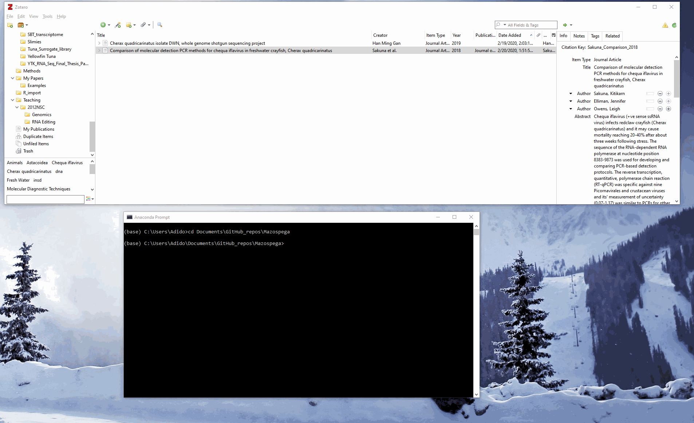

# MAke ZOtero SPEcies Great Again (mazospega)
Italicize and maintain letter case for species names in titles in Zotero collections.

## Background
[Zotero](https://www.zotero.org/) is an amazing free cloud-based reference management tool, with integrated browser and word processing addins, making it an absolute breeze to collect references from the web and use them in your documents. 
Zotero also has great BibTex support for LaTex and markdown lovers (in particular the [Better BibTex extension](https://retorque.re/zotero-better-bibtex/))... 

The one issue I came around working with Zotero is that it doesn't maintain the correct styling for species names (italicized, genus name starts with a capital letter, species name in lower cap letter, such as **_Homo sapiens_**) in the titles of journals, books, theses, etc.  
Zotero titles can be manually edited to include the correct html tags to italicize the species names and to protect it from word capitalization (which happens automatically with some citation styles).  

However, manual labour is not how we do stuff, so when I came across [pyzotero](https://pyzotero.readthedocs.io/en/latest/#), that allows you to read and update items from your Zotero library, I knew I had the tool I needed to write a small program to scan my library based on a list of Genus names (entered manually or via a csv file) and suggest to add the html tags to "correct" the styling of the species names in the titles.

## Usage
1. Prepare a config file that contains your personal Zotero library ID and API key (obtained from [Zotero's web client settings](https://www.zotero.org/settings/keys)). The file is a simple text file, formatted like an `.ini` file, see [example](config/.zoterorc) and below:  
```
[zotero]
api_key = <Paste your Zotero api key here>
library_id = <Paste your Zotero library id here>
library_type = user
# Set library_type to 'group' if you are accessing a shared group library
```
2. Run the script mazospega.py from the Python prompt (windows X11 enabled) or your favourite Python IDE
3. Follow the directions in the popup windows:  
	a. Browse and select your config file  
	b. Enter Genus name, or type CSV to enter it from a file  
	c. If selected CSV, browse and select your input `.csv` file (see [examples](examples/) folder)  
	d. For each suggestion, select whether you would like to proceed and modify the particular title or move to the next one  
4. Open Zotero and syncronize your library to see the magic!



### Requirements
1. List of organisms' genus names in a csv file (one in a line), or manually enter genus names
2. Config file containing Zotero library API key and library ID obtained from [Zotero's web client settings](https://www.zotero.org/settings/keys) 
3. [Python 3.7](https://www.python.org/downloads/) (preferrably installed and managed with [conda](https://docs.conda.io/en/latest/miniconda.html)), with [easygui](https://github.com/robertlugg/easygui) and [pyzotero](https://pyzotero.readthedocs.io/en/latest/#) packages (both can be installed from `conda-forge` channel by typing `conda install -c conda-forge easygui pyzotero`) 
4. Graphical windows enabled system (MS-windows or X11 on linux machines)

### TODO
1. Fix text being truncated in message box
2. Add exception handling for program abort (no input files selection)
3. Tidy up functions
4. Command line version

